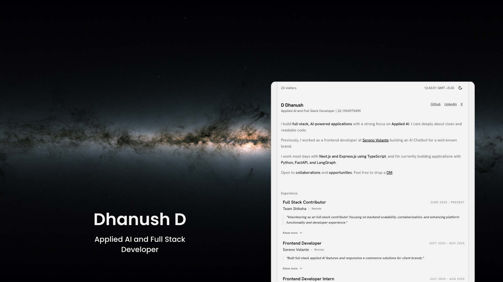

# Portfolio

## D Dhanush

### Applied AI and Full Stack Developer

**Age: 22**

I build full-stack, AI-powered applications with a strong focus on **Applied AI**. I care deeply about clean and readable code. Previously, I worked as a frontend developer at [Sereno Volante](https://www.linkedin.com/company/sereno-ai/) building an AI Chatbot.

---

### Tech Stack

- **Frontend**: Next.js, React, Tailwind CSS
- **State Management**: Redux Toolkit
- **Backend & Database**: Prisma, PostgreSQL, Express.js
- **Runtime & Tools**: Bun, TypeScript

---

### Social Links

If you liked my work, follow me at:

- [GitHub](https://github.com/dhanushd-27)
- [LinkedIn](https://www.linkedin.com/in/dhanush27/)
- [X (Twitter)](https://x.com/orcatwt)
- [Peerlist](https://peerlist.io/dhanush_d27)
- [Email](mailto:dhanushd.work@gmail.com)
